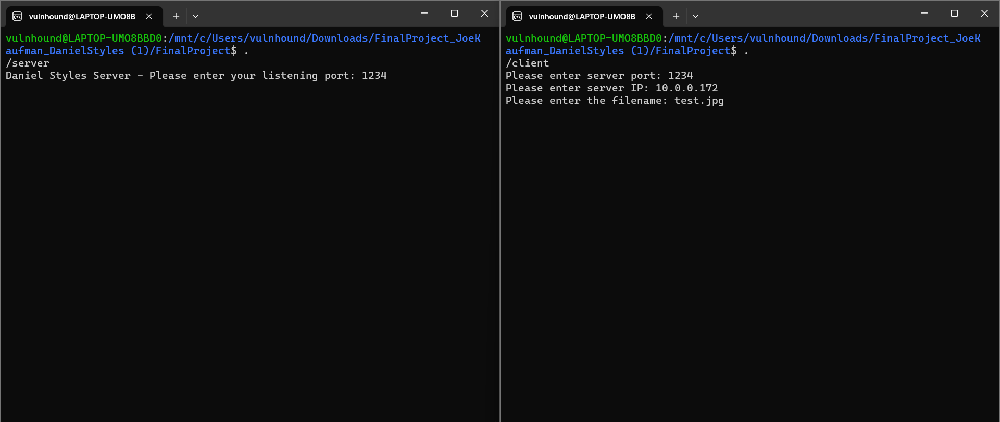
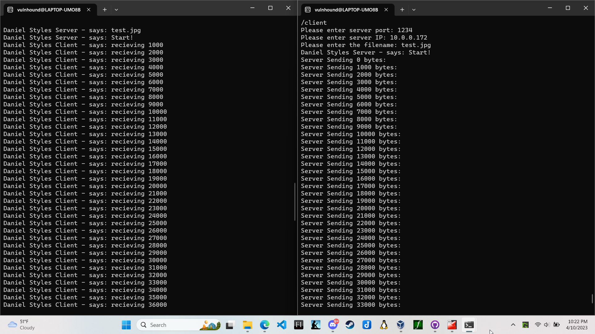
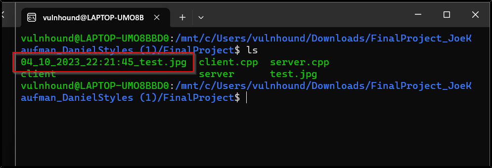

[Back to Portfolio](./)

C++ FTP Server
===============

-   **Class: CSCI 332** 
-   **Grade: 90** 
-   **Language(s): C++** 
-   **Source Code Repository:** [C-FTP-Server](https://github.com/VulnHound/C-FTP-Server)  
    (Please [email me](mailto:dastyles@csustudent.net?subject=GitHub%20Access) to request access.)

## Project description

This project was meant to be a simple file transfer program that utilizes a server and a client. Once the server is run it asks the user for a port to listen on. Once listening, the user should then run the client program. The client program asks the user to enter in the port, IP address, and the file to be sent. Once Enter is hit on the client-side then file transfer begins. Once finished it creates a new file with a timestamp before the filename. 

## How to compile and run the program

How to compile and run the project.

First, compile both files with g++. Then run server first and client afterwards.

```bash
g++ server.cpp -o server
g++ client.cpp -o client
./server
./client
```

## UI Design

The design is simple. It is simply a command line interface program that asks the user for a few bits of networking information before running a file transfer. 

  
Fig 1. Launch and enter in networking information

  
Fig 2. The server and client connect and begin transferring data

  
Fig 3. The file is then created with a timestamp of when the transfer occurred 

## 3. Additional Considerations

This code is meant to be run in a Linux environment as it uses specific networking packages in the C++ code that is targeted towards Linux. Windows users will need to alter the code for it to work in that environment. 

[Back to Portfolio](./)