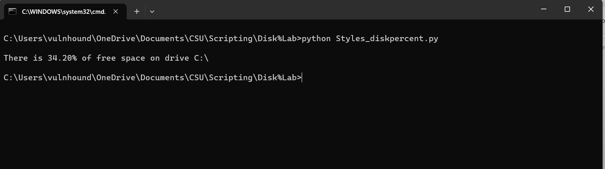
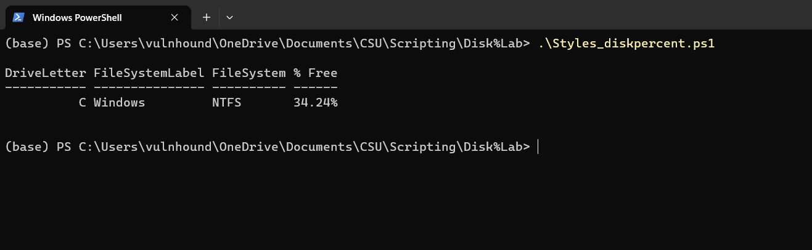

[Back to Portfolio](./)

Disk Percentage
===============

-   **Class: CSCI 301** 
-   **Grade: A** 
-   **Language(s): Python, PowerShell** 
-   **Source Code Repository:** [Disk Percentage](https://github.com/VulnHound/Disk-Percentage)  
    (Please [email me](mailto:dastyles@csustudent.net?subject=GitHub%20Access) to request access.)

## Project description

This is a simple script written in both Python and PowerShell to show the user how much disk percentage they have left on their current machine. You can alter the disk letter to check in both scripts.

## How to run the program

No compilation is needed for these two scripts however to run them you will simply follow the below instructions:


#### Python
```python
python Styles_diskpercent.py
```

#### PowerShell
```ps
.\Styles_diskpercent.ps1
```

## UI Design

This is a simple, yet easy to understand script as it gathers the information requested from the disks and dislays them in an easy to read format. The PowerShell script is better in this sense as it formats the output into a nice table. Both scripts can be easily altered to show any disk letter that is available by editing the script. 

  
Fig 1. Running with Python

  
Fig 2. Running with PowerShell 

[Back to Portfolio](./)