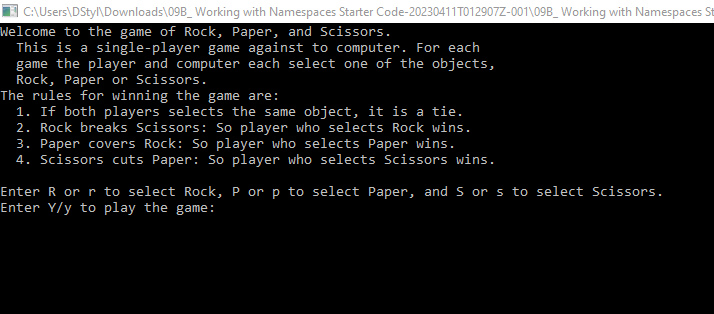
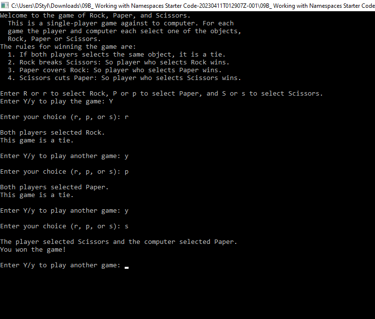
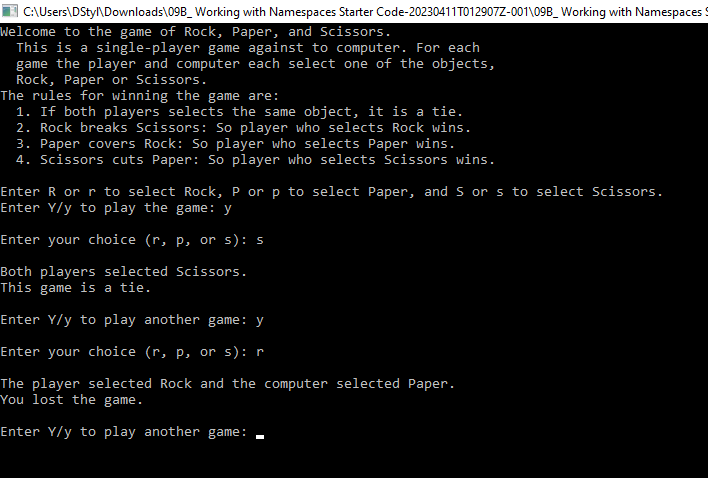

[Back to Portfolio](./)

Rock Paper Scissors
===============

-   **Class: CSCI 235** 
-   **Grade: A-** 
-   **Language(s): C++** 
-   **Source Code Repository:** [Rock Paper Scissors](https://github.com/VulnHound/Rock-Paper-Scissors)  
    (Please [email me](mailto:dastyles@csustudent.net?subject=GitHub%20Access) to request access.)

## Project description

This program is a command-line rock, paper, scissors game written in C++. The program will first ask the user if they want to play the game. If the user enters 'Y' or 'y' then it enters in a loop until the user decides to stop playing. The user is asked to enter in either 'r', 'p', or 's' for rock, paper, or scissors. The computer will select an option at random and score the outcome. It then displays the outcome to the user and asks if they want to play again. If the user enters 'n' then the program will end. 

## How to compile and run the program

```bash
g++ RockPaperScissors.cpp -o rps
```

## UI Design

This is a command-line game meant to utilize the possibilities of randomization and looping until the command to stop is entered. Spacing between outputs has been taken into account and an easy to read screen is present for the user. 

  
Fig 1. Initial Launch

  
Fig 2. Example output of looping and winning a game

  
Fig 3. Example output of looping and losing a game 

[Back to Portfolio](./)